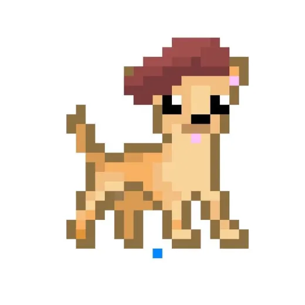
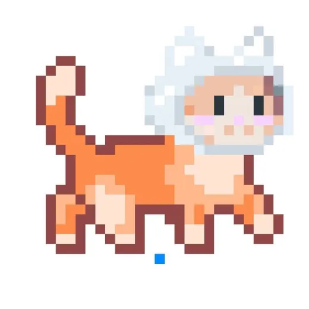

# Callipo the Castronaut 

 By Callipo Studios
 
 Members: 

          
          Alisha Din 2407354 
          Ana Kushchyk 2408544
          Cameron Sayers 2401066
          Mia Barclay 2405897

## Overview
This is a tile map, level based game in which the player needs to navigate their way through the levels, each getting progressively harder until the player suceeds in beating the levels. There will be enemies in which the player can shoot at and kill that also shoot at you. There are ice creams which serve as a point system which you will need to collect a certain amount to pass the level. 

## Narrative 

 The narrative of our game is about Callipo (a ginger space cat) who is travelling from the magically cold Ice-Cream planet to the Cat planet, but he gets aggressively attacked by a hoard of space-pirate dogs. Callipo also owns an Ice Cream van but during the attack, the dogs wrecked and stole it, but while they spaced (drove) off, all the deliciously sweet ice cream dramatically tumbled out of the rear end of the van. Now, our protagonist Callipo must venture onto a rescue mission to restore and collect the sweet cargo that the oh so evil dogs lost. At the end, Callipo must safely return to the Cat planet with his fully stocked Van of ice cream. 

## Game Mechanics 

The Player (callipo) must avoid attacks from the pirate dogs while collecting the fallen ice-creams. Each collected ice cream means that the player gains a point.  

At the beginning of each new level, the dogs upgrade (to different breeds) and become stronger, while the difficulty for Callipo increases.  

The final boss that Callipo must face, is yappy little Chichi the space chihuahua. He must face Chichi inside the Ice cream vans and finally defeat the evil chihuahua.  

## References 
https://editor.p5js.org/ethanfrier/sketches/Sz8fGi37K

## Themes 

The colours and themes for this game will be space-centred, with cute pastel colours for certain characters, backgrounds and items. Inspiration derives from super-mario and 8bit pixel art.   

## Future Implementations
Some aspects we will work to add in the future include multiple levels, sound effects/background music, fighting mechanics, moving enemies etc. 
 
## Aesthetics

We are going for a very cute hyper style theme, which is reflected in the pastel colours we are using. We are also creating all of our assets in a retro pixel art style. 

### Moodboard
 

### Assets
 
Chichi the space dog pirates leader

 
Callipo sitting

 
Callipo walking right

## Roles for the team 

Tile mapping, Main menu, pause menu & Scene changes = Alisha 

Player movement, animation/art assets & player fighting/life system = Anya 

Point system, picking up objects & read.me file/written work = Mia 

Killing enemies, Character art, enemy movement & enemy attacking = Cam 

