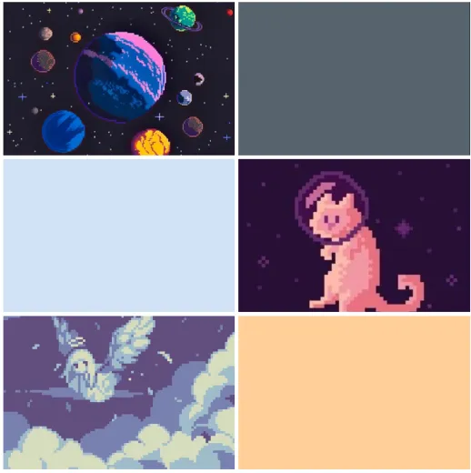

# Callipo the Castronaut 

 By Callipo Studios
 
 Members: 

          
          Alisha Din 2407354 
          Ana Kushchyk 2408544
          Cameron Sayers 2401066
          Mia Barclay 2405897

## Overview
This is a tile map, level based game in which the player needs to navigate their way through the levels, each getting progressively harder until the player suceeds in beating the levels. There will be enemies in which the player can shoot at and kill that also shoot at you. There are ice creams which serve as a point system which you will need to collect a certain amount to pass the level. 

## Narrative 

 The narrative of our game is about Callipo (a ginger space cat) who is travelling from the magically cold Ice-Cream planet to the Cat planet, but he gets aggressively attacked by a hoard of space-pirate dogs. Callipo also owns an Ice Cream van but during the attack, the dogs wrecked and stole it, but while they spaced (drove) off, all the deliciously sweet ice cream dramatically tumbled out of the rear end of the van. Now, our protagonist Callipo must venture onto a rescue mission to restore and collect the sweet cargo that the oh so evil dogs lost. At the end, Callipo must safely return to the Cat planet with his fully stocked Van of ice cream. 

## Game Mechanics 

The Player (callipo) must avoid attacks from the pirate dogs while collecting the fallen ice-creams. Each collected ice cream means that the player gains a point.  

At the beginning of each new level, the dogs upgrade (to different breeds) and become stronger, while the difficulty for Callipo increases.  

The final boss that Callipo must face, is yappy little Chichi the space chihuahua. He must face Chichi inside the Ice cream vans and finally defeat the evil chihuahua.  

Another aim is to have Calipo shoot little bullets that fly towards the dogs. After multiple shots they die 
and disappear.
To move Calipo, the player must use the keys - 'WASD' and attack the dogs by using the space bar.

## References 

We used the code from lesson as a base in regards to tile mapping and movement.

https://editor.p5js.org/ethanfrier/sketches/Sz8fGi37K
This is what we referenced in order to create a shooting mechanic. We are looking to work and improve this as we have not yet got it to work.

https://www.youtube.com/watch?v=JHBuRkJObIg&list=PLBDInqUM5B25FzygoJ9Ifg1TZXmIHz4zh&index=7
Referenced this video to create game stages and to help create a simple start screen. Further I will take the code and adjust it to make various different levels and an end screen.

All of our assets currently are images found online. They are simply placeholder images while we create our own assets.

## Themes 

The colours and themes for this game will be space-centred, with cute pastel colours for certain characters,
backgrounds and items. Inspiration derives from super-mario and 8bit pixel art. One aim we have is to have
different backgrounds for the three levels. Some examples include the first being a simple, starry sky in 
space. The second could possibly have little planets displayed in the background if that's not too ambitious
with the workload and deadline considered. Then the final idea for the background is Calipos van. As 
mentioned in game mechanics, the final level ("fight") plans to take place inside the Ice-Cream van.

## Future Implementations
Some aspects we will work to add in the future include multiple levels, sound effects/background music, fighting mechanics, moving enemies etc. 
 
## Aesthetics

We are going for a very cute hyper style theme, which is reflected in the pastel colours we are using. We are also creating all of our assets in a retro pixel art style. 

### Moodboard
 

### Assets
 
Chichi the space dog pirates leader

 
Callipo sitting

 
Callipo walking right

## Roles for the team 

Tile mapping, Main menu, pause menu & Scene changes = Alisha 

I used the tile mapping code from lesson as a base to create the background of the game. I used placeholder assets for now until our art assets have been created. I want to improve on the tile mapping by firstly making it bigger and also adding more strategic collisions. I also want to create a kind of collision where if the player hits a certain square on the tile map, they get sucked in and pop out of another section, a kind of tunnel system. I also created the stage scene mechanic which controls what function is displayed when. I set it up so it always first opens on the title starting screen, and after the player clicks the screen - which is the condition- it will increment the stage value by 1 causing the scene to change to the game play and allowing the user to play the game. I also want to improve on this by adding various different levels and also a condition that if the player dies by getting hit a certain nummber of times, the level resets. As well as if they manage to reach the end, it moves them onto the next level until they reach the last level and win. I also want to create a pause menu to so they can pause the screen whenever they want to. I will research and figure out how to do this layer on.

Player movement, animation/art assets & player fighting/life system = Anya

I used the player and player movement code from lesson and from the notion slides. For the player sprites i am currently using placeholders- when the player moves there are 3 different sprites that can appear depending on direction but later on i will change it to be 4 with our original assets. Later on i want to change the player movement to be smoother as having to press a key multiple times just to move in the same direction can be a bit clucnky, i would perhaps make it so that if you hold a key you could move several spaces. For player shooting mechanic i got it to work with mouseX and mouseY but would want this instead be in relation to the current player location. Im not sure how i would go about in accessing the players current possition in the bullet code. Once i get the shooting to work as intended i might try and improve them further by making it so that you can shoot in different directions instead of just upwards.
(Add a cooldown to the shooting)

Point system, picking up objects & read.me file/written work = Mia 

<<<<<<< HEAD
I started off with writing the read.me file with a descriptive narrative of the game plan. I then developed the game mechanics section and described how they worked. I also described the themes and inspiration for the game, as well as the moodboard which shows our inspiration of pastel colours and 8bit art for the game. I started to work on my parts of the code; successfully got the point system in, however, size adjustment of the text is needed (make it bigger and bolder with strokeweight). Also, I need to fix the issue of 'POINTS' disappearing after the character moves. I now have the code ready for the IceCream point systems, but as of now, it is still commented and needs correct placement on the code.

 I have yet to implement the life system for the player, the player will likely have 3 lives and one hit from the enemy would reseult in the loss of 1 heart/life.
=======
(reminder 1 ice cream = 1 point) Point text has been placed in top left corner. 

 psudo = if player hits icecreamSprite points + 1

(if player collides with icecreamSprite then add 1 to point system)
elseif (this means if player doesn't) leave the point system as is. 

Aim for the next updates:

- Make the icecreams show up and disappear when hit. 
- Figure out how to keep the point text fixed (talk to anya, could be to do w her bullet thing)
07/03 - GOAL

- When you hit the ice cream, number goes up
- Make the ice cream disappear
09/03 - GOAL

>>>>>>> 894298ae5d0da1bac59a1b0adc589455a3ee0aa5

Killing enemies, Character art, enemy movement & enemy attacking = Cam 

